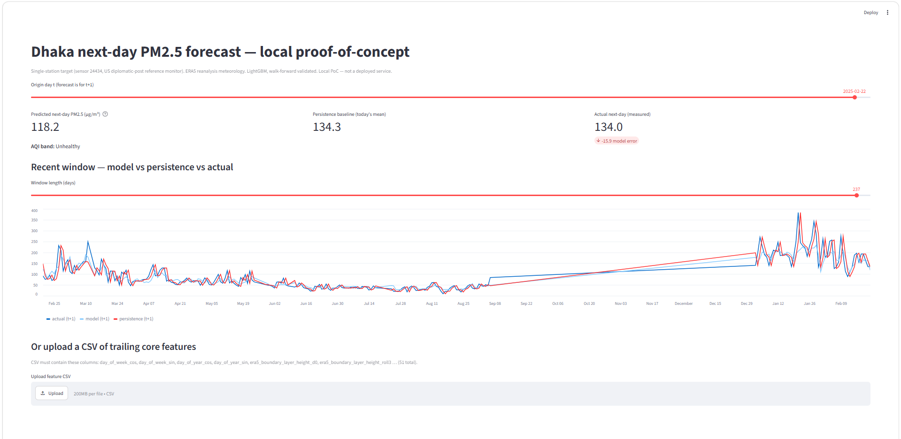

# MASTER DOCUMENTATION
## Dhaka Next-Day PM2.5 Forecasting System — explained from zero

> **Who is this for?** Everyone. You do **not** need to know machine learning, statistics,
> or Python. If you can read, you can understand this document. We start from the very basics
> ("what is PM2.5?") and build up to "here is exactly what the model does, why it is good
> enough for a research paper, and how to run the app yourself."
>
> **What is this project in one sentence?** A computer program that looks at today's air
> pollution, weather, calendar, and nearby fires in Dhaka, and predicts **how dirty the air
> will be tomorrow** — specifically tomorrow's average fine-dust level (PM2.5) at one trusted
> air monitor.

---

## Table of contents

1. [Concepts you need (plain English)](#1-concepts-you-need-plain-english)
2. [The agenda — what we are doing and why it helps](#2-the-agenda--what-we-are-doing-and-why-it-helps)
3. [What exactly is predicted (the target)](#3-what-exactly-is-predicted-the-target)
4. [Folder & file structure — every folder, every file](#4-folder--file-structure--every-folder-every-file)
5. [Installation (step by step)](#5-installation-step-by-step)
6. [How to run the whole project](#6-how-to-run-the-whole-project)
7. [Results — the numbers the model achieved on this machine](#7-results--the-numbers-the-model-achieved-on-this-machine)
8. [The features — what the model "looks at"](#8-the-features--what-the-model-looks-at)
9. [Why THIS model is suitable for the research paper](#9-why-this-model-is-suitable-for-the-research-paper)
10. [The Streamlit app — screenshot + annotated walkthrough](#10-the-streamlit-app--screenshot--annotated-walkthrough)
11. [Glossary (one-line definitions)](#11-glossary-one-line-definitions)

---

## 1. Concepts you need (plain English)

Read these once. Everything else in the document uses these words.

| Word | Baby-simple meaning |
|------|---------------------|
| **PM2.5** | Tiny dust/smoke particles in the air, smaller than 2.5 micrometres (≈30× thinner than a human hair). Breathing them is harmful. Measured in **µg/m³** (micrograms per cubic metre of air). Higher number = dirtier, more dangerous air. |
| **Forecast** | A guess about the future made from information we have now. A weather forecast guesses tomorrow's rain; **we guess tomorrow's air pollution.** |
| **Next-day forecast** | We stand on **today** (call it day *t*) and predict **tomorrow** (day *t+1*). We never peek at tomorrow's real numbers when making the guess. |
| **Daily mean** | The average of all the hourly readings in one day. We predict the **average for the whole day**, not one single hour. |
| **Sensor / station / monitor** | A physical machine that sits in one place and measures the air. We use **one specific machine** (sensor 24434). |
| **Feature** | One piece of information we feed the model (e.g. "yesterday's pollution", "today's wind speed"). The model studies many features at once. |
| **Model** | The "brain" that learns the pattern between the features (inputs) and tomorrow's pollution (answer). Ours is mainly **LightGBM**, a type of decision-tree model. |
| **Baseline** | A dumb, simple guess we must beat to prove the model is worth anything. Example: *"tomorrow will be the same as today"* (called **persistence**). If our smart model can't beat the dumb guess, it's useless. |
| **Skill score** | How much better the model is than the dumb baseline. `+0.15` skill ≈ "15% less error than the dumb guess." Bigger = better. `0` = no better than dumb. Negative = worse than dumb. |
| **RMSE / MAE** | Two ways to measure error (how far the guess was from the truth). **Lower is better.** RMSE punishes big misses harder; MAE is the plain average miss. Units are µg/m³. |
| **R²** | "How much of the up-and-down pattern did the model capture?" Ranges 0→1. Closer to 1 = better. |
| **Leakage** | **The #1 sin in forecasting.** Accidentally letting the model see the answer (or future info) while it studies. It makes the model look amazing in testing but useless in real life. A huge part of this project is **proving we never cheated** this way. |
| **Walk-forward validation** | The honest way we test: train the model on the past, test it on the strictly-later future — like real life. Never shuffle days, never train on the future. |
| **Hold-out** | The final exam. We lock away the **most recent 12 months** of data, never let the model study or tune on it, then test on it **once** at the very end. |
| **AQI band** | A colour/word label (Good, Moderate, Unhealthy…) that turns a raw PM2.5 number into a public-health message. We use the US EPA 2024 scale. |

---

## 2. The agenda — what we are doing and why it helps

**The agenda:** Build a **publication-grade, cheat-free system** that forecasts **tomorrow's
average PM2.5 in Dhaka** from information available **today**, and prove honestly that it beats
the simple guesses.

**Why this matters (why it helps real people):**

- **Public health warnings.** Dhaka is one of the most polluted cities on Earth. If we can
  tell people *tonight* that *tomorrow* will be "Unhealthy", vulnerable people (children,
  elderly, asthmatics) can stay indoors, wear masks, or avoid exercise outside.
- **City planning & policy.** Agencies like **BAPA**, the **Department of Environment (DoE)**,
  and **BUET** can use day-ahead forecasts to time interventions and study pollution drivers.
- **A defensible research paper.** The whole point is **methodological honesty**, not fancy
  tricks. A clean, simple model that *honestly* beats naive forecasts is worth more in peer
  review than a flashy deep-learning model that can't be trusted. Target journals: *Air
  Quality, Atmosphere & Health* and *Atmospheric Pollution Research*.

**What we are deliberately NOT doing** (and why):
- Not predicting CO₂ (this dataset has **no** CO₂; only carbon *monoxide* as a helper signal).
- Not making a pollution **map** — we have only **one** trustworthy station, so this is a
  forecast **in time** at one point, not a guess across space.
- Not over-claiming. We report the small sample size and the deep model's failure honestly.

---

## 3. What exactly is predicted (the target)

> **Target = the next-day (t+1) daily-mean PM2.5 at OpenAQ sensor 24434**, predicted from data
> available through day *t*.

- **Sensor 24434** is the **US diplomatic-post reference monitor** in Dhaka (~2 km from the
  city centre) — a high-quality, trusted instrument.
- **Daily mean** is taken over the **local Dhaka calendar day** (Asia/Dhaka, UTC+6) — a
  citizen's day, not a UTC day.
- A day **only counts** if it has **≥18 valid hourly readings** (so we don't average a day
  that was mostly broken/missing).

**Why one raw sensor instead of the ready-made `openaq_pm25` column?** (Important — this is the
defining decision of the project.) The dataset ships a column called `openaq_pm25`, but a
Phase-0 investigation **proved** it is secretly the **hourly average of ~14 different monitoring
sites spread across ~17 km**. Averaging distant sites would break the "single-point forecast"
story. So we throw that column away as a target and take the answer **straight from one sensor
(24434)**.

**The cost of that honesty:** sensor 24434 reported continuously 2016→2025 but **went offline
after 2025-03-24**. That leaves **N ≈ 1,746** supervised (today → tomorrow) day-pairs. That is a
**small** dataset, and we say so plainly.

| Fact | Value |
|------|-------|
| Target variable | `pm25_next_day_daily_mean` (sensor 24434) |
| Qualifying days (≥18 valid hrs) | 1,899 |
| Supervised (t, t+1) pairs (true N) | **1,746** |
| Origin-day span | 2016-11-10 → 2025-03-23 |
| Target mean / std | 90.7 / 68.6 µg/m³ |

A picture of this coverage and the train/test split lives at
[`figures/coverage_split.png`](figures/coverage_split.png).

---

## 4. Folder & file structure — every folder, every file

Top-level layout (the `raw/` data folder and caches are git-ignored but exist on disk):

```
Machine Learning Model/
├── CLAUDE.md                       # project "source of truth": facts & locked decisions
├── CLAUDE_CODE_MASTER_PROMPT.md    # the build plan (phases 0–10 + acceptance rules)
├── README.md                       # short entry point (this file is the long version)
├── MASTER_DOCUMENTATION.md         # ← YOU ARE HERE (the full beginner guide)
├── data_dictionary.md              # what every column in the dataset means + its source
├── requirements.txt                # the list of Python packages needed
├── manifest.json                   # record of the raw data sources merged together
├── config/
│   └── config.yaml                 # EVERY setting (seed, 18h rule, model search, AQI bands)
├── src/                            # the program code (one job per file)
├── app/
│   └── streamlit_app.py            # the clickable web app (the proof-of-concept UI)
├── reports/                        # human-readable results, one markdown per phase
├── figures/                        # the PNG charts (SHAP, coverage) for the paper
├── artifacts/                      # the trained models, saved to disk
├── processed/                      # the cleaned, model-ready data tables
├── raw/                            # the original raw data (git-ignored, large)
├── docs/                           # images for this documentation (e.g. app screenshot)
└── .claude_memory/                 # the project's "diary" so work survives restarts
```

### Root files

| File | What it is |
|------|-----------|
| `CLAUDE.md` | The **source of truth**: the verified dataset facts and the *locked decisions* (target, validation scheme, etc.). Authoritative. |
| `CLAUDE_CODE_MASTER_PROMPT.md` | The step-by-step **build plan** — the 10 phases and the rules (especially the anti-cheating / anti-leakage rules). |
| `README.md` | The **short** entry point. Quick start + headline results. This `MASTER_DOCUMENTATION.md` is the **long, beginner** version. |
| `data_dictionary.md` | A dictionary of **every column** in the raw dataset: its meaning, unit, and where it came from. Authoritative for units. |
| `requirements.txt` | The **shopping list** of Python packages (pandas, lightgbm, etc.). |
| `manifest.json` | A record of which raw data **sources** were merged to build the master dataset. |

### `config/` — the settings folder

| File | What it is |
|------|-----------|
| `config.yaml` | **The single control panel.** Every number the code uses lives here: the random seed (42), the ≥18-hour rule, the forecast horizon, the walk-forward scheme, the feature groups, the model search spaces, and the AQI breakpoints. **There are no magic numbers hidden in the code.** |

### `src/` — the program code (each file = one job)

| File | Its job (plain English) |
|------|------------------------|
| `utils.py` | Helpers: load the config, set the random seed (so results are repeatable), find folders. |
| `data_loader.py` | Reads the big dataset (for features) and the single-sensor file (for the answer/target). |
| `targets.py` | Builds the "answer key": tomorrow's daily-mean PM2.5, applying the ≥18-hour rule. |
| `features.py` | Builds the inputs the model studies (yesterday's pollution, weather, calendar, fires) — **carefully, so no future info leaks in.** |
| `validation.py` | Splits time honestly: the walk-forward folds + the locked 12-month final exam. |
| `baselines.py` | The dumb guesses the model must beat (persistence, climatology, lag-7). |
| `evaluate.py` | The scorekeeper: computes RMSE, MAE, R², and skill scores. |
| `models_tree.py` | Trains the tree models (LightGBM/XGBoost/RandomForest) + tunes them with Optuna, all without cheating. |
| `models_deep.py` | The Bi-LSTM + attention deep-learning **comparison** model (the "honesty test"). |
| `build_dataset.py` | **Driver** for Phases 2–3: builds `processed/supervised_daily.parquet`. |
| `run_baselines.py` | **Driver** for Phase 4: runs the dumb baselines, writes the report. |
| `run_models.py` | **Driver** for Phase 5: trains + tunes the tree models, writes the report. |
| `run_deep.py` | **Driver** for Phase 6: runs the deep comparison model. |
| `run_shap.py` | **Driver** for Phase 7: explains the model (which features mattered), makes the SHAP charts. |
| `run_ablations.py` | **Driver** for Phase 8: turns feature groups on/off to see what carries the forecast. |
| `run_self_audit.py` | **Driver** for the final exam: a 23-point checklist that proves no cheating + reproducibility. |

> "**Driver**" = a script you actually run from the terminal. The non-driver files are the
> toolboxes the drivers use.

### `app/` — the web app

| File | What it is |
|------|-----------|
| `streamlit_app.py` | The clickable dashboard. Loads the trained LightGBM model and lets a non-coder pick a day and see the predicted pollution. (Walkthrough in [Section 10](#10-the-streamlit-app--screenshot--annotated-walkthrough).) |

### `reports/` — the results, in words

| File | What it contains |
|------|-----------------|
| `phase0_data_audit.md` | The data-verification audit + the single-station discovery + the decision to use sensor 24434. |
| `phase2_feature_dictionary.md` | Every engineered feature, its group, and its *timing* (the leakage justification). |
| `phase3_target.md` | The exact target definition + the day/pair counts. |
| `phase4_baselines.md` | The dumb-baseline scores (the bar to beat). |
| `phase5_models.md` | The tree-model scores, skill vs baselines, best Optuna params, verdict. |
| `phase6_deep_comparison.md` | The deep model vs the trees, with the small-N caveat (the honest null result). |
| `phase7_results.md` | The SHAP explainability: which signals carry the forecast. |
| `phase8_ablations.md` | The feature-group ablation table + the `omaq_pm2_5` circularity caveat. |
| `self_audit.md` | The final 23/23 pass/fail leakage + reproducibility checklist. |
| `phase0_audit.py`, `phase0_station.py`, `phase0_target_24434.py` | Read-only scripts that reproduce the Phase-0 numbers. |
| `plot_coverage_split.py` | A standalone script that draws the coverage/split timeline → `figures/coverage_split.png`. |

### `figures/` — the charts (for the paper)

| File | What it shows |
|------|--------------|
| `coverage_split.png` | Timeline of the sensor's data + where the train/CV/hold-out split lands + the offline date. |
| `shap_beeswarm.png` | Per-feature impact for every prediction (the classic SHAP cloud plot). |
| `shap_bar.png` | The top features ranked by average importance. |
| `shap_group_attribution.png` | The pie/bar of which **group** (weather vs pollution-memory vs fire…) carries the forecast. |

### `artifacts/` — the trained models

| File | What it is |
|------|-----------|
| `model_lightgbm.joblib` | **The primary trained model** + its fold-fitted preprocessing. This is what the app loads. |
| `model_xgboost.joblib`, `model_random_forest.joblib` | The two secondary trained models. |
| `lgbm_best_params.json` | The winning LightGBM settings that Optuna found. |

### `processed/` — the clean data

| File | What it is |
|------|-----------|
| `supervised_daily.parquet` | **The model-ready table**: one row per origin day *t*, 62 columns (features + tomorrow's answer). |
| `dhaka_aq_master.parquet` / `.csv` | The merged master dataset (hourly). The raw master is never overwritten. |
| `feature_groups.json` | Which feature belongs to which group (used by SHAP + ablations). |
| `baseline_rmse.json` | The baseline RMSEs saved for downstream comparison. |

### `raw/` — the original data (git-ignored, large)

The original per-source data, including `raw/openaq/sensor_24434_pm25.parquet` — **the single
sensor file that the whole target is built from.**

### `docs/` and `.claude_memory/`

| Path | What it is |
|------|-----------|
| `docs/` | Images used by this documentation (e.g. the app screenshot). |
| `.claude_memory/architecture_decisions.md` | A dated diary of every decision + why. |
| `.claude_memory/state_tracker.json` | Machine-readable phase status, so work can resume after a break. |

---

## 5. Installation (step by step)

**You need:** Python **3.11 or newer** (this machine used **Python 3.12.10**).

> ⚠️ **Windows note:** if your editor (VS Code) shows red squiggles under `import pandas` /
> `import matplotlib`, that is **not** a real error — it means the editor is pointing at the
> wrong Python. The file [`.vscode/settings.json`](.vscode/settings.json) pins the correct
> Python 3.12 interpreter to silence those false warnings. The code runs fine.

**Step 1 — open a terminal** in the project folder (the folder that contains `README.md`).

**Step 2 — install the packages:**

```bash
python -m pip install -r requirements.txt
```

That reads `requirements.txt` and installs pandas, lightgbm, xgboost, scikit-learn, optuna,
shap, torch (for the deep model), streamlit (for the app), matplotlib, and pyarrow.

**Step 3 — (optional) freeze the exact versions** for a perfect reproducibility record:

```bash
python -m pip freeze > requirements.lock
```

That's it. You're ready to run.

---

## 6. How to run the whole project

Run these **in order** from the project folder. Each line writes its results into `reports/`,
`artifacts/`, `processed/`, or `figures/`.

```bash
# 1. Build the model-ready table (Phases 2–3)
python src/build_dataset.py        # -> processed/supervised_daily.parquet

# 2. The dumb baselines — the bar to beat (Phase 4)
python src/run_baselines.py        # -> reports/phase4_baselines.md

# 3. Train + tune the tree models with walk-forward CV (Phase 5)
python src/run_models.py           # -> artifacts/model_*.joblib, reports/phase5_models.md

# 4. The deep-learning comparison / honesty test (Phase 6, slow: CPU ~15 min)
python src/run_deep.py             # -> reports/phase6_deep_comparison.md

# 5. Explain the model with SHAP (Phase 7)
python src/run_shap.py             # -> figures/shap_*.png, reports/phase7_results.md

# 6. Feature-group ablations (Phase 8)
python src/run_ablations.py        # -> reports/phase8_ablations.md

# 7. The final no-cheating exam (expect 23/23 PASS)
python src/run_self_audit.py       # -> reports/self_audit.md
```

**Then launch the clickable app:**

```bash
streamlit run app/streamlit_app.py
```

Your browser opens at **http://localhost:8501**. (See [Section 10](#10-the-streamlit-app--screenshot--annotated-walkthrough).)

> **Want just the app?** If `artifacts/model_lightgbm.joblib` and
> `processed/supervised_daily.parquet` already exist (they do on this machine), you can skip
> straight to `streamlit run app/streamlit_app.py`.

---

## 7. Results — the numbers the model achieved on this machine

> All numbers below were produced by **running the pipeline on your machine** (Python 3.12,
> seed = 42). "CV" = walk-forward cross-validation (5 folds). "Hold-out" = the locked final 12
> months (n = 236, 2024-03-24 → 2025-03-23), scored **once**. **Lower RMSE/MAE = better.**

### 7.1 The bar to beat — dumb baselines

| Baseline | CV RMSE | CV MAE | Hold-out RMSE |
|----------|---------|--------|---------------|
| persistence ("tomorrow = today") | 33.12 | 22.00 | 35.58 |
| climatology (day-of-year average) | 44.45 | 32.07 | 36.78 |
| seasonal-naive (lag-7) | 50.04 | 34.48 | 44.13 |

**Persistence is the hard one to beat** — air pollution is very "sticky" day to day.

### 7.2 The headline models (tree models)

| Model | CV RMSE | Hold-out RMSE | Hold-out R² | Skill vs persistence (hold-out) |
|-------|---------|---------------|-------------|---------------------------------|
| **LightGBM (PRIMARY)** | **30.26** | **30.25** | **0.809** | **+0.150** |
| XGBoost | 30.83 | 31.17 | 0.798 | +0.124 |
| RandomForest | 30.77 | 30.97 | 0.800 | +0.130 |

✅ **All three beat persistence.** LightGBM is the winner and becomes the primary model.

### 7.3 The deep-learning comparison (the honesty test)

| Model | CV RMSE | Hold-out RMSE |
|-------|---------|---------------|
| LightGBM (primary) | **30.26** | 30.25 |
| Bi-LSTM + attention | 36.97 | 30.73 |
| persistence baseline | 33.12 | 35.58 |

The Bi-LSTM **underperforms** LightGBM and even loses to persistence on cross-validation
(skill −0.116). **This is the expected, honestly-reported result** — deep sequence models are
data-hungry, and N ≈ 1,746 is tiny. We report it as a finding, not a failure to hide. **This
honesty is a strength for peer review.**

### 7.4 Where the forecast comes from (SHAP)

| Signal group | Share of the model's decisions |
|--------------|-------------------------------|
| **Weather (ERA5 meteorology)** | **58.0%** |
| Pollution memory — recent lags | 23.2% |
| Pollution memory — rolling stats | 13.5% |
| Calendar (season/day-of-week) | 5.1% |
| Fire (NASA FIRMS) | 0.2% |

**Top individual features:** `era5_dew_point_2m` (humidity proxy), `pm25_lag_1` (yesterday's
pollution = the persistence signal), 7-day rolling pollution average, cloud cover, wind gusts,
surface pressure. **The dominance of weather is exactly what reviewers want** — it means the
model learned the *physics* of pollution (boundary-layer height, wind dispersion, humidity),
not just "tomorrow ≈ today."

Charts: [`figures/shap_beeswarm.png`](figures/shap_beeswarm.png),
[`figures/shap_bar.png`](figures/shap_bar.png),
[`figures/shap_group_attribution.png`](figures/shap_group_attribution.png).

### 7.5 Ablations — which signals actually help

| Feature set | # features | CV RMSE | Skill vs persistence (CV) |
|-------------|-----------|---------|---------------------------|
| weather only | 25 | 35.30 | −0.066 (worse than dumb) |
| weather + calendar | 33 | 34.91 | −0.054 |
| **weather + calendar + pollution lags** | 49 | **30.24** | **+0.087** |
| core (default model) | 51 | 30.31 | +0.085 |
| core + CAMS chemistry | 55 | 30.31 | +0.085 |
| core + `omaq_pm2_5` (CAVEATED) | 52 | 30.31 | +0.085 |

**Key reading:** weather *alone* can't beat persistence — the big jump comes when we **add the
pollution lag/rolling features**. The near-circular CAMS `omaq_pm2_5` field adds **nothing**
(Δ ≈ 0.00), so it is correctly **excluded** from the default model (it is a model's *guess* of
PM2.5, so using it to predict measured PM2.5 would be near-circular cheating).

### 7.6 The final self-audit

✅ **23 / 23 checks PASS.** Docstring coverage **87 / 87**. Every leakage rule, every project
constraint (PM2.5-only, single-station verified, reanalysis labelled, no invented traffic, no
out-of-scope data), and every required artifact/report was verified. See
[`reports/self_audit.md`](reports/self_audit.md).

---

## 8. The features — what the model "looks at"

The model studies **51 core features**, all knowable **on day t or earlier** (plus
deterministic calendar facts of t+1, which are knowable in advance). Grouped:

| Group | Examples | Why it helps |
|-------|----------|-------------|
| **ERA5 weather (reanalysis)** | dew point, wind speed/gusts/direction, surface pressure, cloud cover, precipitation, boundary-layer height — each as the day-t value and a 3-day rolling average | Weather controls how pollution disperses or accumulates. This is the **biggest** signal (58%). |
| **Pollution lags** | yesterday's mean (`pm25_lag_1` = the persistence signal), and 2/3/7-day-ago means | Pollution is sticky; recent days predict tomorrow. |
| **Pollution rolling stats** | 3/7/14-day rolling mean, std, min, max (each ending on day t — never including tomorrow) | Captures the recent trend and volatility. |
| **Calendar / cyclical** | sine/cosine of month, day-of-week, day-of-year; weekend flag; Bangladesh holidays | Captures seasonal (winter = worse) and weekly human-activity rhythms. |
| **Fire (NASA FIRMS)** | active-fire count and total radiative power near Dhaka | Flags biomass-burning episodes. (Small effect here: 0.2%.) |
| *Ablation-only groups* | CAMS chemistry (CO, NO₂, SO₂, O₃…), ACAG satellite annual grid, CAMS `omaq_pm2_5` | **Not** in the default model — used only in ablations, with caveats (model-estimates, not measurements). |

> **The leakage rule, stated simply:** a feature describing *tomorrow* may only use real data up
> to *today*. The only thing about tomorrow we're allowed to "know" in advance is its
> **calendar** (we always know tomorrow's date, day-of-week, and season). Every rolling window
> **ends on day t** so it can never peek at the answer.

Full per-feature detail: [`reports/phase2_feature_dictionary.md`](reports/phase2_feature_dictionary.md).

---

## 9. Why THIS model is suitable for the research paper

This is the section reviewers care about. **The bar is methodological defensibility, not
architectural novelty.** Here is why this LightGBM-based system clears that bar:

1. **It honestly beats the hard baseline.** Persistence ("tomorrow = today") is a brutally
   strong baseline for sticky pollution. LightGBM beats it by **+0.15 skill** on a *locked,
   never-touched* hold-out — a modest but **real and defensible** edge, and a large edge over
   climatology (+0.32).

2. **It is leakage-proof, and we prove it.** A 23/23 automated audit verifies: features use
   only past data; every learned transform (imputer, anomaly flag, scaler) is fit on
   training folds **only**; the hold-out was scored **once** and Optuna never saw it; the
   target's future is never imputed. **In peer review, a defensible "no-leakage" story matters
   more than a high R².**

3. **It is interpretable / physically meaningful.** SHAP shows **58% of the signal is
   meteorology** (boundary-layer height, wind, humidity) — the model learned the *physics* of
   dispersion, not a black-box trick. Reviewers can see *why* it predicts what it predicts.

4. **It is honest about its limits.** We report the small sample (N ≈ 1,746) caused by the
   single-station decision, and we report that the deep Bi-LSTM **lost** — instead of hiding it
   or over-tuning to manufacture a win. **An honest null result strengthens credibility.**

5. **It matches the data.** With only ~1,746 day-pairs, a regularized gradient-boosting model is
   the *right tool*. A heavy deep network would be indefensible at this N — and our experiment
   demonstrates exactly that, on purpose.

6. **It is fully reproducible.** One config file holds every setting; one seed (42) is logged
   each run; every result has a script and a report. Anyone can re-run and get the same numbers.

> **In one line for the paper:** *"A clean, leakage-controlled gradient-boosting model that
> demonstrably and honestly beats persistence and climatology baselines for next-day PM2.5 at a
> single Dhaka reference monitor, with physically interpretable meteorology-dominated
> attribution."* That is publishable in *Air Quality, Atmosphere & Health* or *Atmospheric
> Pollution Research*.

---

## 10. The Streamlit app — screenshot + annotated walkthrough

> **To view the app:** run `streamlit run app/streamlit_app.py`, then open
> **http://localhost:8501** in your browser. It is a **local proof-of-concept** — it runs on
> your machine only and is not deployed to the public internet.

### The screenshot




### Annotated walkthrough — what every part means

Read this with the screenshot. Each numbered item is a thing you see on screen, top to bottom.

**① Title bar — "Dhaka next-day PM2.5 forecast — local proof-of-concept"**
The headline. The subtitle reminds you: *single-station target (sensor 24434, US
diplomatic-post reference monitor), ERA5 reanalysis meteorology, LightGBM, walk-forward
validated. Local PoC — not a deployed service.* In plain words: "this is a demo of the trained
model, running on your computer."

**② "Origin day t (forecast is for t+1)" — the top slider**
This is **the day you pretend it is "today."** Drag it to any date the sensor has data for
(here: **2025-02-22**). The app then predicts the **next** day (t+1). Think: *"Pretend it's
Feb 22. What will Feb 23's air be?"*

**③ "Predicted next-day PM2.5 (µg/m³)" — the big left number (118.2)**
**The model's answer.** This is LightGBM's guess for tomorrow's daily-average PM2.5. The little
"?" is a help tooltip.

**④ "AQI band: Unhealthy"**
The model's number turned into a **public-health label** (US EPA 2024 scale). 118 µg/m³ falls
in the **"Unhealthy"** band — meaning everyone may feel effects, sensitive groups more so. This
is the part a non-expert actually acts on.

**⑤ "Persistence baseline (today's mean)" — the middle number (134.3)**
**The dumb guess** for comparison: "tomorrow = today's average." It's shown so you can see
whether the smart model moved away from the naive answer (it did: 118.2 vs 134.3).

**⑥ "Actual next-day (measured)" — the right number (134.0), with "↓ -15.9 model error"**
**The real answer** (because this is a historical date we can check). The red chip shows the
model's error: it predicted **15.9 µg/m³ lower** than reality this particular day. (On this
day, persistence happened to be closer — single days vary; the model wins **on average across
the whole hold-out**, which is what the Section 7 tables prove.)

**⑦ "Recent window — model vs persistence vs actual" — the chart**
A time-series plot comparing three lines over a recent stretch of days:
- **dark blue = actual (t+1)** — the truth.
- **light blue = model (t+1)** — LightGBM's predictions.
- **red = persistence (t+1)** — the dumb baseline.
When the light-blue line hugs the dark-blue line better than the red line does, the model is
beating persistence. (The straight diagonal segment is just the chart bridging a data gap.)

**⑧ "Window length (days)" — the second slider (237)**
Controls **how many recent days** the chart shows. Drag left for a zoomed-in recent view, right
to see the whole span.

**⑨ "Or upload a CSV of trailing core features" — the upload box**
For advanced users: instead of picking a historical day, you can **upload your own row** of the
51 core features (the box lists the exact column names required) and the model will predict from
that. The "200MB per file • CSV" is just the upload size limit. A normal user can ignore this.

**⑩ Top-right "Deploy" button + ⋮ menu**
These are **Streamlit's own built-in buttons**, not part of our project. "Deploy" is Streamlit's
generic "host this online" shortcut — **ignore it**; this project is intentionally local-only.

### How a newbie uses it (3 steps)
1. **Drag slider ②** to any date you want to forecast from.
2. **Read the big number ③ and the AQI band ④** — that's tomorrow's predicted air and its
   health label.
3. **Glance at the chart ⑦** to see how well the model tracks reality recently.

That's the whole app.

---

## 11. Glossary (one-line definitions)

| Term | One line |
|------|----------|
| **PM2.5** | Fine airborne particles ≤2.5 µm; harmful to breathe; measured in µg/m³. |
| **µg/m³** | Micrograms of pollutant per cubic metre of air. |
| **t / t+1** | "today" / "tomorrow" — we predict t+1 from data through t. |
| **Persistence** | Baseline guess: "tomorrow = today." |
| **Climatology** | Baseline guess: "tomorrow = the historical average for this day-of-year." |
| **Skill score** | How much the model beats a baseline; `+0.15` ≈ 15% less error; higher better. |
| **RMSE / MAE** | Error measures (µg/m³); lower is better. |
| **R²** | Fraction of the pattern captured (0→1); higher better. |
| **Leakage** | Accidentally letting the model see the future/answer; the cardinal sin we prevent. |
| **Walk-forward CV** | Honest testing: train on past, test on later future, never shuffle. |
| **Hold-out** | The locked final 12 months, scored once at the end. |
| **LightGBM** | The winning gradient-boosted decision-tree model (our primary). |
| **Optuna** | The tool that automatically searches for the best model settings. |
| **SHAP** | A method that explains which features drove each prediction. |
| **Ablation** | Turning feature groups on/off to measure what actually helps. |
| **Bi-LSTM + attention** | The deep-learning comparison model (lost, on purpose, honestly). |
| **ERA5** | A high-quality **reanalysis** weather dataset (model + observations blended). |
| **NASA FIRMS** | Satellite fire-detection data (active-fire count + radiative power). |
| **AQI band** | Word label (Good…Hazardous) translating PM2.5 into a health message. |
| **Sensor 24434** | The single US diplomatic-post reference monitor that defines our target. |

---